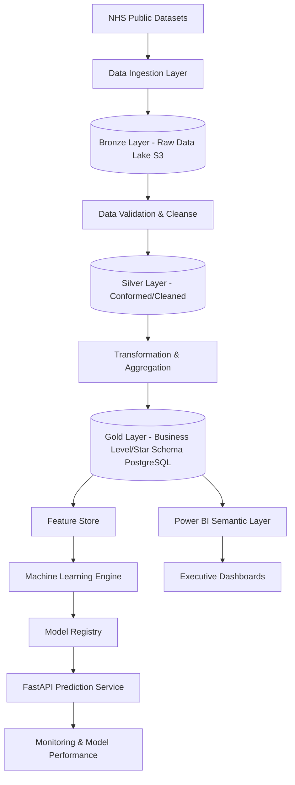

# Healthcare Capacity Intelligence Platform

## Technical Architecture & Solution Design

### Executive Summary

The Healthcare Capacity Intelligence Platform is a production-style analytics system designed to ingest large-scale NHS operational datasets, automate data quality validation, perform demand forecasting and breach-risk prediction, expose predictions through APIs, and deliver executive insights through Power BI.

The platform demonstrates competencies across:

* Data Engineering (Medallion Architecture)
* Data Warehousing
* Machine Learning
* MLOps
* Cloud Deployment
* Business Intelligence
* CI/CD Automation

Target dataset size:
* 500,000 – 5,000,000+ records

Primary business use case:
* Predict future referral demand
* Forecast waiting list growth
* Identify potential service bottlenecks
* Provide operational planning insights

---

# High-Level Architecture (Medallion Pattern)

---

# Layer 1: Data Ingestion (Bronze Layer)

**Technology:** Python, Pandas, AWS S3, GitHub Actions
**Purpose:** Store immutable raw copies of the source data.

**Data Sources:**
* NHS Referral-to-Treatment datasets
* Waiting List datasets
* Activity datasets
* Demographic reference datasets

**Pipeline Steps:**
1. Download source files
2. Schema validation
3. Store immutable raw copies in S3 (Bronze)
4. Generate ingestion audit logs
5. Trigger Silver transformation workflow

**Artifacts:**
`bronze/referrals`, `bronze/waiting_lists`, `bronze/activity`, `bronze/demographics`

---

# Layer 2: Data Quality & Cleansing (Silver Layer)

**Technology:** Python, PySpark/Pandas, AWS S3
**Purpose:** Prevent poor-quality data from progressing; create a conformed, cleansed version of the data.

**Validation Rules:**
* Missing values & duplicate records
* Invalid dates (e.g., future timestamps)
* Outlier & schema mismatch detection

**Pipeline Steps:**
1. Read from Bronze
2. Apply validation rules and data cleansing
3. Standardize date formats and naming conventions
4. Write to Silver storage

**Artifacts:**
`silver/referrals_cleaned`, `silver/dq_results`, `silver/dq_failures`

---

# Layer 3: Business Data & Warehousing (Gold Layer)

**Technology:** Python, SQL, PostgreSQL
**Purpose:** Provide business-level aggregations and dimensional models for reporting and ML.

**Tasks:**
* Surrogate key generation
* Feature engineering
* Star schema modeling

**Outputs (PostgreSQL Tables):**
* Facts: `fact_referrals`, `fact_waiting_list`, `fact_appointments`
* Dimensions: `dim_date`, `dim_hospital`, `dim_specialty`, `dim_region`

---

# Layer 4: Feature Store

**Purpose:** Centralized storage for ML features, typically sourced from the Gold layer.

**Features:**
* **Rolling Metrics:** 7-day, 30-day, 90-day referrals
* **Time Features:** Week number, Month, Quarter
* **Operational Features:** Current backlog, Historical wait time, Service demand growth

**Storage:** `feature_waiting_time`, `feature_demand_forecast`, `feature_breach_risk`

---

# Layer 5: Machine Learning Layer

**Model 1: Demand Forecasting**
* **Objective:** Predict referral demand for future periods.
* **Algorithm:** XGBoost Regressor
* **Inputs:** Historical demand, Seasonality, Service line, Region
* **Output:** Predicted referrals

**Model 2: Waiting Time Prediction**
* **Objective:** Estimate expected waiting duration.
* **Algorithm:** LightGBM
* **Output:** Predicted waiting days

**Model 3: Breach Risk Prediction**
* **Objective:** Predict likelihood of target breach.
* **Algorithm:** XGBoost Classifier
* **Output:** Risk Score (0-100)

**Model Evaluation Metrics:**
* **Regression:** MAE, RMSE, MAPE
* **Classification:** Precision, Recall, F1 Score, ROC AUC

---

# Layer 6: Model Registry

**Purpose:** Track model lifecycle and versioning.

**Stored Metadata:**
* Version, Training Date, Metrics, Dataset Version, Feature Set

**Storage:** AWS S3 (`models/demand_forecast_v1.pkl`, `models/metadata.json`)

---

# Layer 7: Prediction API

**Technology:** FastAPI
**Endpoints:**
* `GET /health`
* `POST /predict-demand`
* `POST /predict-wait-time`
* `POST /predict-breach-risk`
* `GET /model-metrics`

---

# Layer 8: Monitoring Layer

**Purpose:** Monitor data quality and model performance.

**Metrics:**
* **Data Metrics:** Missing Values, Freshness, Volume
* **Model Metrics:** Prediction Accuracy, Drift, Error Trend

**Dashboard:** Power BI Operational Monitoring

---

# Layer 9: Business Intelligence Layer

**Technology:** Power BI
**Data Source:** PostgreSQL (Gold Layer)

**Dashboard Pages:**
1. **Executive Overview:** Total Referrals, Waiting List Size, Predicted Demand
2. **Demand Forecasting:** Actual vs Forecast, Growth Trend
3. **Waiting Time Analysis:** Service Performance, Backlog Analysis
4. **Breach Risk Monitoring:** Risk Heatmap, Predicted Breaches
5. **ML Operations Dashboard:** Model Accuracy, Drift Monitoring

---

# CI/CD & Deployment Architecture

**CI/CD Pipeline (GitHub Actions):**
Push → Unit Tests → Data Validation → Model Training → Docker Build → Deploy to AWS → Run Smoke Tests

**AWS Deployment:**
* **AWS S3:** Data Lake (Bronze/Silver) & Model Registry
* **AWS EC2 / ECS:** FastAPI Service
* **RDS PostgreSQL:** Data Warehouse (Gold)
* **GitHub Actions:** CI/CD
* **Power BI:** Reporting Layer

---

# Non-Functional Requirements

* **Scalability:** Support 5M+ records
* **Availability:** 99% uptime target
* **Performance:** API response < 2 seconds
* **Security:** Environment variables, Secrets management
* **Auditability:** Complete model & data lineage tracking
